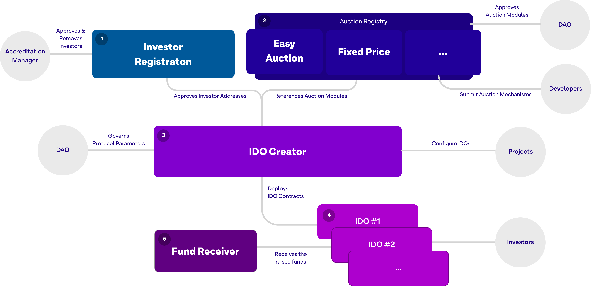

# Mesa Contracts



## Instructions

Install dependencies

```
yarn
yarn build
```

Running tests:

```
yarn test
```

Run migration:

```
yarn deploy --network $NETWORK
```

Verify on etherscan:

```
npx hardhat verify --network $NETWORK DEPLOYED_CONTRACT_ADDRESS
```